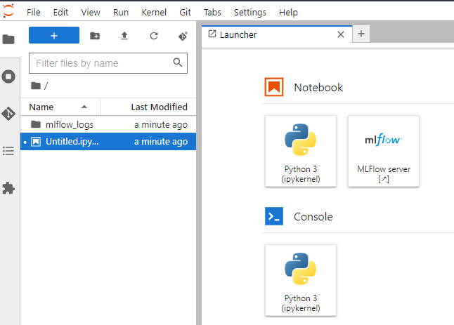
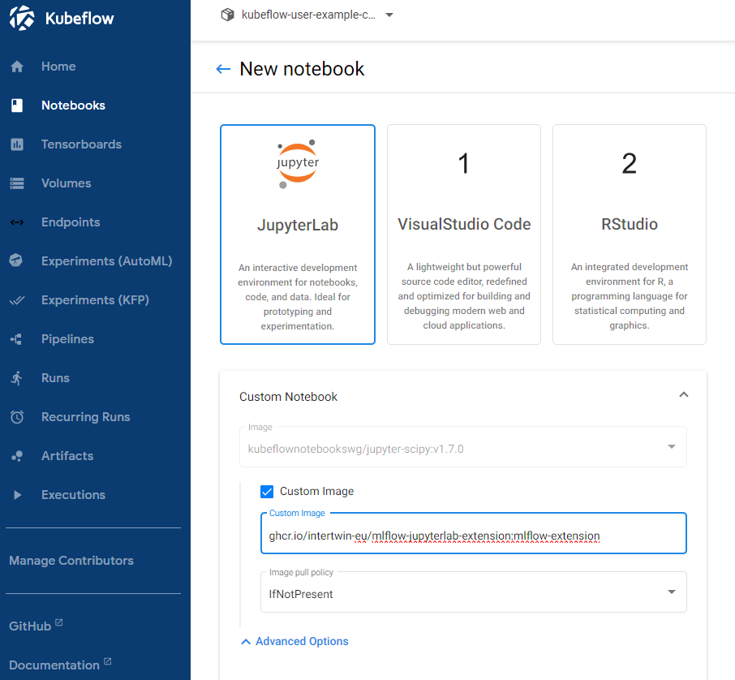

# MLFlow extension for JupyterLab

This is meant to be tested for KubeFlow notebook servers,
to allow interTwin
use cases to access MLFlow functionalities from KubeFlow.

It appears as:



## Installation (KubeFlow)

Create a new notebook server, using the image provided in
[this repo](https://github.com/orgs/interTwin-eu/packages?repo_name=mlflow-jupyterlab-extension)
as custom image:



## Usage

In JupyterLab, from a notebook:

```python
import mlflow

# HTTP connection requires the server to be running!
# Namely, you executed it by clicking on the extension
# mlflow.set_tracking_uri('http://127.0.0.1:50001')

# This is a "safer" approach, although it is bound to
# the local filesystem
mlflow.set_tracking_uri('mlflow_logs')

mlflow.set_experiment('test-exp')
mlflow.start_run()
mlflow.log_metric('my_metric', 17)
mlflow.end_run()
```

Now go to the MLFlow server extension to see the logs.

## Developers

This extension is based on
[Jupyter Server Proxy](https://github.com/jupyterhub/jupyter-server-proxy).
Read the [docs](https://jupyter-server-proxy.readthedocs.io/en/latest/)
for more info.

This can be tested in a virtual environment based on
Micromamba (conda).

### Micromamba installation

To manage Conda environments we use micromamba, a light weight version of conda.

It is suggested to refer to the
[Manual installation guide](https://mamba.readthedocs.io/en/latest/micromamba-installation.html#umamba-install).

Consider that Micromamba can eat a lot of space when building environments because packages are cached on
the local filesystem after being downloaded. To clear cache you can use `micromamba clean -a`.
Micromamba data are kept under the `$HOME` location. However, in some systems, `$HOME` has a limited storage
space and it would be cleverer to install Micromamba in another location with more storage space.
Thus by changing the `$MAMBA_ROOT_PREFIX` variable. See a complete installation example for Linux below, where the
default `$MAMBA_ROOT_PREFIX` is overridden:

```bash
cd $HOME

# Download micromamba (This command is for Linux Intel (x86_64) systems. Find the right one for your system!)
curl -Ls https://micro.mamba.pm/api/micromamba/linux-64/latest | tar -xvj bin/micromamba

# Install micromamba in a custom directory
MAMBA_ROOT_PREFIX='my-mamba-root'
./bin/micromamba shell init $MAMBA_ROOT_PREFIX

# To invoke micromamba from Makefile, you need to add explicitly to $PATH
echo 'PATH="$(dirname $MAMBA_EXE):$PATH"' >> ~/.bashrc
```

**Reference**: [Micromamba installation guide](https://mamba.readthedocs.io/en/latest/installation.html#micromamba).

### Install the Python virtual environment

Create the virtual environment through the Makefile:

```bash
make
```

### Test JupyterLab locally

```bash
micromamba run -p ./.venv jupyter-lab
```
